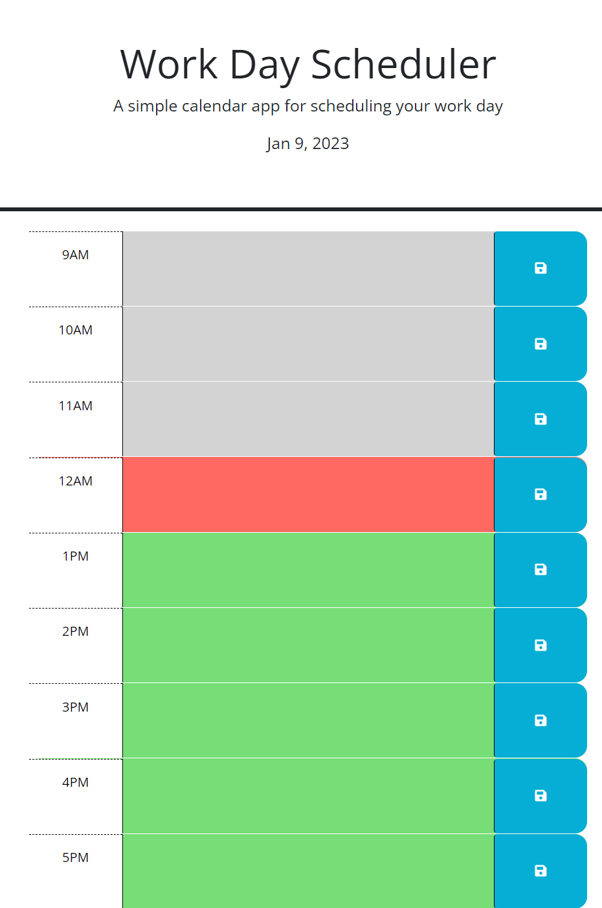

# Work Day Scheduler

## Description

I made this program so people could organize what they have to do for their full workday. It is very easy to navigate the program and set your tasks easily.

## Installation

N/A

## Usage

You set an event by typing it in to the text box at a given time block, then click the save button. The time block will be grey if it is the current hour corresponding to that timeblock. The timeblock will be green if the time block is at a later hour, and it will be red if the current hour has already surpassed the hour of the corresponding timeblock.

https://harljos.github.io/work-day-scheduler/

## Credits

N/A

## License

N/A
